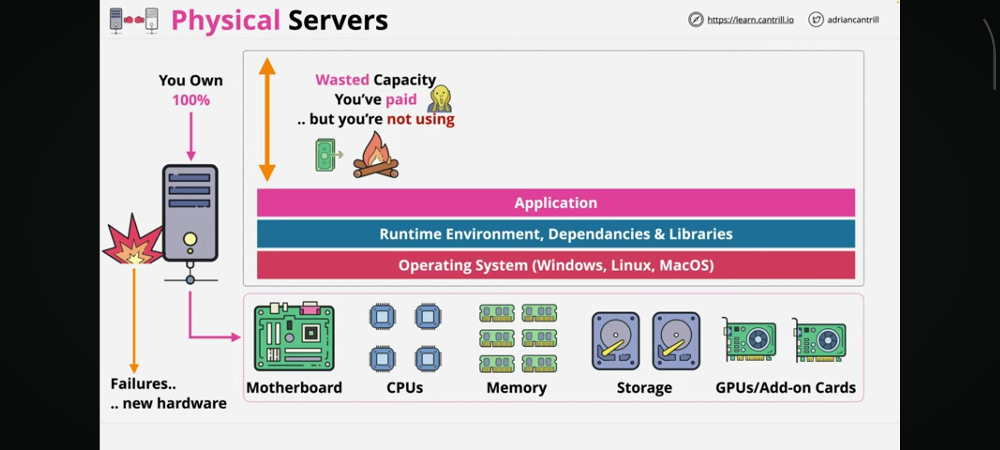
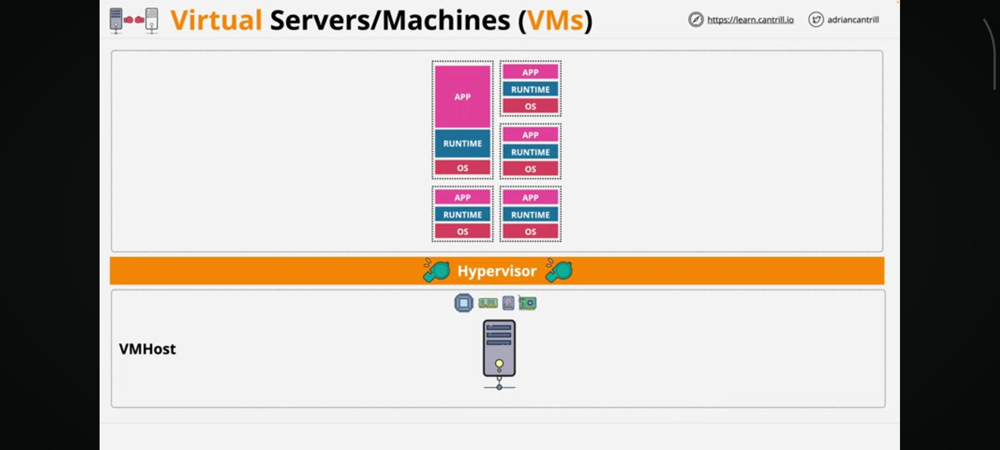

# Docker Fundamentals
Docker Fundamentals by Adrian Cantrill
## Introduction To Docker

### Physical Servers vs Virtual Servers

Physical Server consists of following (bottom to top):

- Physical/Hardware Resources (CPU, Memory, Storage etc.)
- OS
- Runtime Environment & Dependencies 
- Application



Issues: If you fail to estimate resources, you either waste or overuse server resource. On the other hand, hosting multiple applications can create one point of failure.

Virtual Servers consist of the following (bottom to top):

- ​Physical/Hardware Resources (VM Host): The physical CPU, Memory, and Storage. A single environment can be supported by multiple hosts.

- ​Hypervisor: (e.g., VMware, Hyper-V, VirtualBox). This acts as the referee, managing and distributing the VM Host's physical resources to the virtual layers above.

- ​Virtual Machines (VMs): Each VM is an isolated environment sitting on top of the Hypervisor. A single VM includes:

 - ​Operating System (Guest OS): Each VM runs its own independent OS (Windows, Linux, etc.).

 - ​Runtime Environment & Dependencies: The specific libraries or engines (like Java, Python, or .NET) required for the apps.

 - ​Application(s): The actual software services being hosted.




### What are Containers?

### Installing Docker on your local machine

## Docker 101

### Docker Architecture

### Interacting with Docker Engine

### Container & Image Architecture

### Working with existing Docker Images

#### Commands

```
docker pull image-name

docker run --name custom-container-name image-name

docker images

docker ps

docker ps -a

docker run --name custom-container-name -p 8080:80 -d image-name

docker inspect container-id

docker logs container-id

docker exec -it container-id ps -aux
```
<pre>
docker exec -it container-id sh
<b>Then run shell commands</b>
</pre>

```
docker restart container-id

docker start container-id

docker stop container-id

docker rm container-id

docker rmi image-name
```

### Dockerfile Syntax

#### Instructions in caps, argument in small letters

FROM - Sets the Base Image from build, e.g. Alpine (Small Linux Distro 5MB)

LABEL - Adds metadata, e.g., Description, Maintainer, to the image

**Following the three instructions creates new layers in the Docker image**

RUN - Runs commands in a new layer, e.g. install packages or configuration

COPY - Copy files/folders from src (client machine) to the destination (new image layer)

ADD - Same as COPY but can add from remote URL & do extraction (adding application/web files)

<br>
CMD - Sets the default executable of a container, e.g. start a web server. Can be overridden by docker run parameters  


ENTRYPOINT - As above, but can't be overridden. More for single purpose image

EXPOSE - Informs Docker what port the container app is running on. Metadata only (No network configuration)


### Build and Run Simple Containerised Application

```
docker build -t name/image-name .
```

## More Docker

### Docker Storage

Writable Layer - File systems layer and writable layer creates an Union file systems. Requires file systems driver. Not persistent, cannot be shared with other containers

tmpfs - Fast - Host memory. Temporary storage. Not persistent, cannot be shared with other containers. Useful for temp, sensitive data

Bind Mounts - Bind mounts map host's folder to container folder, Not persistent, can be shared with other containers. If mapped folder structure does not exist in other host (not managed by Docker), it will not work.

Volumes - Storage managed by Docker, Persistent, can be shared with other containers as long as no file locking

### Docker Networking

Host Networking: Container shares the host's network.
Host port = Container app port
So multiple containers can not use the same port in the same host. For example, if a container app runs on tcp 1337, another container of the same app can not use the same port in the same host as its already taken. But you can run different containers on different ports.

Bridge Networking - Bridge network is created separately so multiple containers can share the network and communicate with each other. Each container gets its own unique Private IP so multiple containers can use the same port. APP 1: Private IP1: 1337, APP2: Private IP2:1337.

To reach from outside, the container needs to be published using -p host port: container port

**Container 1:**
```
docker run -p 1337:1337 image-name
```
**Container 2:**
```
docker run -p 1338:1337 image-name
```

### Extending Container Application using Environment Variables

Using -e input key value pair, keys should be in capital letters
```
docker run
--name phpmyadmin -d
-p 8081:80
-e PMA_ARBITRARY=1
phpmyadmin/phpmyadmin

docker run
--name db
-e MYSQL_ROOT_PASSWORD=somewordpress
-e MYSQL_PASSWORD=wordpress
-e MYSQL_DATABASE=wordpress
-e MYSQL_USER=wordpress
-d mariadb:10.6.4-focal
--default-authentication-plugin=mysql_native_password

docker ps -a

docker inspect container-id/db
```

Look for "IPAddress": "XXXXXXXXXX", this is the internal Docker network IP that the DB container is running on. Note this down as DB_IP

Open http://localhost:8081 to access phpmyadmin enter DB_IP for the server

Enter root for username

Enter somewordpress for password


### Docker Bind Mounts

Because bind mount, maps a file or folder in the Docker host to the container
First, you need to have the folder

**Linux**

```
mkdir -p docker-host-dir
```

**Windows**
```
mkdir docker-host-dir
```
or create the folder using GUI

There are two options to bind mount

-v

or

--mount

**Linux**

**Example --mount** 

In the MariaDB image /var/lib/mysql is the MariaDB container file location

```
docker run 
--mount
type=bind,
source="$(pwd)"/docker-host-dir,
target=/var/lib/mysql
image-name
```

**Example -v**

```
docker run 
-v "$(pwd)"/docker-host-dir:/var/lib/mysql
image-name
```

**Windows:**

**Example --mount**

In the MariaDB image /var/lib/mysql is the MariaDB container file location

```
docker run
--mount
type=bind,
source=%cd%/docker-host-dir,
target=/var/lib/mysql
image-name
```
**Example -v**

```
docker run
-v %cd%/docker-host-dir:/var/lib/mysql
image-name
```

`Please note: If you type these commands into a terminal exactly as above (on multiple lines), they will fail unless you use a line-continuation character. Linux: Use a backslash (\) at the end of every line. Windows (CMD): Use a caret (^) at the end of every line.`

At first, files will be copied to the Docker host, then any update on either will reciprocate in both locations


### Docker Named Volumes

Managed by Docker, persists even if the container is deleted
If a new container uses the same volume then the existing data will be reused. For example, DB data.

You can explicitly create the volume; otherwise docker run command will create it

**Creating & Deleting Volume**

```
docker create volume mariadb_data

docker volume ls

docker volume inspect mariadb_data

docker volume rm mariadb_data
```

**Example --mount**

```
docker run
--name db
--mount source= mariadb_data,
target = /var/lib/mysql
-d image-name
```

**Example -v**

```
docker run
--name db
-v mariadb_data: /var/lab/mysql
-d image-name
```


### Docker Compose

Docker Compose is a way to create and manage multi-container applications. It works using a YAML configuration file called compose.yaml or docker-compose.yml.

compose.yaml (yml) or legacy docker-compose.yaml (yml) creates resources

**Resources:** containers, network, volumes

Run from the Docker host, the Docker daemon (dockerd) then uses the compose file to create, delete or update multiple containers, networks, and volumes.

It also manages connections between multiple containers internally or outside.

If required to pull container images then it is pulled from docker registry.

### Docker Compose with Application

As long as the file is saved as docker-compose.yaml or compose.yaml (For indentation tab not allowed, space 2 per level must be used within file)

Then you can run the following commands:

**Start:**

```
docker compose up -d
```

**Stop:**
```
docker compose stop
```

**Stop & Delete:**
```
docker compose down
```

**For different file names:**

```
docker compose -f my-app.yaml up -d
```


### Docker Container Registry

Docker Container Registry is a registry just like GitHub but for container images.

### Uploading Application to Docker Hub

Docker Hub is an example of a container registry.

It's public, but possible to run private registry.

docker pull and docker push commands to pull and push a container from Docker Hub.

Format: authorName/containerName:tags

Example: aCantrill/containerForCats:latest
